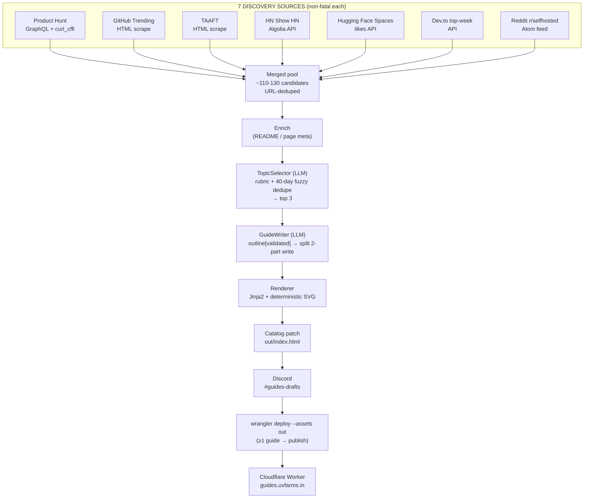

# 📚 Automatic Guides Writer

> **A daily autonomous agent that writes, renders, and publishes "build-your-own-clone" programming guides.**

Every day at **06:00 IST**, this agent scans **6 trending-tech sources**, uses an **LLM** to pick the 3 most guide-worthy topics, **writes complete step-by-step HTML blueprints** in the style of [guides.uvfarms.in/local_rag_guide](https://guides.uvfarms.in/local_rag_guide), posts them to a private **Discord** channel for review, and **deploys** them to Cloudflare — all without human intervention.

Built by **UVF IT**. Internal project.

---

## 🧭 Table of Contents

1. [What It Does](#-what-it-does)
2. [How the Pipeline Works](#-how-the-pipeline-works)
3. [Tech Stack](#-tech-stack)
4. [Project Structure](#-project-structure)
5. [Architecture Diagram](#-architecture-diagram)
6. [Prerequisites](#-prerequisites)
7. [Setup](#-setup)
8. [Configuration (.env)](#-configuration-env)
9. [Usage / CLI](#-usage--cli)
10. [Scheduling (Ubuntu VPS)](#-scheduling-ubuntu-vps)
11. [Publishing to Cloudflare](#-publishing-to-cloudflare)
12. [Testing](#-testing)
13. [Observability & Ops Runbook](#-observability--ops-runbook)
14. [Troubleshooting](#-troubleshooting)
15. [First-Week Monitoring Plan](#-first-week-monitoring-plan)
16. [Roadmap & Backlog](#-roadmap--backlog)
17. [License](#-license)

---

## 🤖 What It Does

| Capability | Detail |
|---|---|
| **Discovery** | Merges candidates from 6 sources into one deduplicated pool |
| **Selection** | LLM scores candidates against a rubric and picks the top 3 guide topics, avoiding anything built in the last 40 days |
| **Writing** | Two-stage LLM generation: an outline (validated against a rubric) → a full multi-phase, code-heavy guide |
| **Rendering** | Deterministic HTML via Jinja2 + a hand-crafted SVG architecture diagram, pixel-matched to the reference guide |
| **Delivery** | Rich Discord embeds with the HTML file attached to a private channel |
| **Catalog** | Auto-patches the deployment `index.html` with a clickable card for each new guide |
| **Publishing** | Deploys the whole `out/` static site to a Cloudflare Worker |
| **Resilience** | Every source is non-fatal; one scraper or API going down never stops the others |

---

## 🛠 How the Pipeline Works

The orchestration lives in `guides_writer/pipeline.py` and runs as:

```
discover → enrich → select → write ×3 → render ×3 → catalog → deliver → publish
```

### Stage breakdown

1. **Discover (`fetch_pool`)** — every adapter's `fetch()` runs in sequence. Each returns a list of `CandidateItem`s. A failing source raises a `SourceError` that's caught, logged as `failed_sources`, and skipped. Results are pooled and **URL-deduplicated** (trailing-slash aware).

2. **Enrich (`agents/writer.py:enrich`)** — for GitHub candidates, fetches the README; otherwise fetches page `<meta>` description. This gives the LLM real context about what the topic builds, then truncates to a budget (keeps the prompt under the Groq token window).

3. **Select (`agents/selector.py:TopicSelector`)** — the merged pool (usually 100–130 candidates) + the last `HISTORY_DAYS` (default 40) of `history.json` are formatted into a prompt. The LLM returns a `RawSelection` (JSON) of up to `GUIDES_PER_RUN` picks, each with `title`, `angle`, `why_guide_worthy`, `difficulty`, `est_minutes`, `tags`. A **fuzzy-dedupe** pass (`rapidfuzz` `token_set_ratio` ≥ 82) drops picks too close to recent history → if fewer than requested survive, the run is flagged `degraded`.

4. **Write (`agents/writer.py:GuideWriter`)** — **two-stage** per guide, to stay inside Groq's free-tier 8k token/min window:
   - *Outline*: `chat_json(..., schema=GuideOutline)` → title, tagline, intro, warning, `DiagramSpec`, and 4–6 phases each with ≤3 code blocks and ≥1 "check" step. Validated against a **rubric** (`_rubric_violations`): ≥4 phases, ≥1 code/phase, ≥3 checks, no duplicate ids.
   - *Write*: split into `GuidePart1` (intro + first phases) and `GuidePart2` (remaining phases + conclusion), each a separate LLM call with pacing sleeps. The two parts are stitched into a validated `Guide` pydantic model.

5. **Render (`render/renderer.py`)** — Jinja2 template `guide.html.j2` with **autoescape always on**, CSS from `guide.css` (verbatim from the reference), inline SVG built by `svg_builder.py` (Python geometry, LLM only supplies labels), `.code-comment` comment highlighting, and a post-render validation pass.

6. **Catalog (`render/catalog.py:patch_catalog`)** — inserts a new guide card (title, stack, date, tagline, gradient) into `out/index.html`, keeping the newest first with pagination.

7. **Deliver (`deliver/discord.py`)** — a rich **green embed** (0x2E7D32) per guide + the `text/html` file as an attachment; waits out `Retry-After` on 429 with up to 4 attempts.

8. **Publish** — `scripts/publish.ps1` / `scripts/publish.sh` runs `wrangler deploy --assets out --name uvf-guides`. Triggered whenever **≥1 guide was produced** (even on partial runs).

---

## 🧰 Tech Stack

### Language & Runtime
| Component | Choice | Why |
|---|---|---|
| Language | **Python 3.11+ (3.13 used)** | Fast to write, huge ecosystem for scraping/LLM/parsing |
| Package mgmt | `pip` + `requirements.txt` | Simple, pinned-ish, cross-platform |
| Target deploy | **Ubuntu VPS** (`cron` + `flock`) | Cheap always-on schedule; dev on Windows |

### Data / Serialization
| Component | Choice | Why |
|---|---|---|
| Typed models | **Pydantic v2** (`BaseSettings`, `BaseModel`) | Validation, JSON-schema for LLM, `.env` config |
| Config | **pydantic-settings** + **python-dotenv** | Type-safe `.env` loading |
| Rich text | `Markup` via renderer | Safe `**bold**`/inline-code conversion (autoescape) |
| State | `data/history.json` (utf-8-sig tolerant) | 40-day rolling dedupe |
| Run logs | `data/runs/YYYY-MM-DD.json` | Every run's audit summary |

### Networking & Scraping
| Component | Choice | Why |
|---|---|---|
| HTTP client | **httpx** | Async-capable, clean response API, used for tokens JSON |
| TLS impersonation | **curl_cffi** | Bypasses Product Hunt's Cloudflare "Just a moment" via real Chrome TLS fingerprints |
| HTML parsing | **BeautifulSoup4 + lxml** | Robust, fast scraping of GitHub Trending / TAAFT |
| Source APIs | Algolia (HN), Hugging Face, Dev.to, Reddit Atom | Official/free JSON — no scraping needed |

### LLM / AI
| Component | Choice | Why |
|---|---|---|
| Provider | **Groq** (free tier) — `api.groq.com/openai/v1` | High throughput, generous free quota |
| Model | **`qwen/qwen3.6-27b`** (default) | Free-tier, separate 200k TPD quota; `gpt-oss-120b` / `grok-4-fast` swappable |
| Client | OpenAI-compatible `httpx` wrapper | Provider-agnostic (`LLM_BASE_URL` swap) |
| Retries | **tenacity** (8s→70s ×6 backoff) | Absorbs transient 429/5xx |
| Structured output | `chat_json` with Pydantic schema | Validates LLM output; auto-repair + multi-attempt recovery |
| JSON hardening | `JSONValidateError` + `failed_generation` | Provider `json_validate_failed` → retry + targeted completion |
| Dedupe | **rapidfuzz** (`token_set_ratio` @ 82) | Fuzzy-match against `HISTORY_DAYS` (40) history |

### Rendering / Frontend
| Component | Choice | Why |
|---|---|---|
| Templating | **Jinja2** | HTML generation with strict autoescape |
| Styling | Verbatim CSS from reference guide | Pixel-faithful clone output |
| Diagrams | **Deterministic SVG** (`svg_builder.py`) | Python-computed geometry — no LLM-drawn images |
| Deployment site | Static `out/` → **Cloudflare Workers** | Fast global CDN, free, asset hosting |

### Infrastructure / Ops
| Component | Choice | Why |
|---|---|---|
| CDN/deploy | **Cloudflare Workers** (`uvf-guides`, `wrangler`) | `--assets out` static hosting on a Worker |
| Custom domain | `guides.uvfarms.in` → CNAME → `uvf-guides.deleat-in.workers.dev` | Dedicated branding |
| Scheduling | **cron** (`CRON_TZ=Asia/Kolkata`) + **flock** lock | Prevents overlapping runs; 06:00 IST |
| Log rotation | **logrotate** (`ops/logrotate.conf`) | Daily rotation, keep 14 |
| Alerts / delivery | **Discord webhook** | Private `#guides-drafts` channel |
| Windows trigger | `Run Guides Writer.bat` on desktop | One-click daily run + auto-publish |
| Abuse/error alerts | AdSense `ca-pub-7707820592878194` embedded in guides | Revenue + site audit trail |

### Tooling / Dev
| Component | Choice | Why |
|---|---|---|
| Testing | **pytest** | 73 offline tests, fixtures + fakes |
| Fixtures | `fixtures/` (HTML, JSON, XML snapshots) | Deterministic offline tests for every source |
| Deployment | `wrangler` via `scripts/publish.{ps1,sh}` | One command to deploy the site |
| CI-safety | No network in default `pytest` | Runs anywhere, deterministically |

---

## 📁 Project Structure

```
Automatic Guides Writer/
├── guides_writer/
│   ├── __main__.py            # CLI: hello | test-sources | select | render-sample | run
│   ├── config.py              # pydantic-settings Settings model (.env)
│   ├── pipeline.py            # orchestrator: discover → enrich → select → write ×3 → render → catalog → deliver
│   ├── sources/
│   │   ├── base.py            # CandidateItem (pydantic), SourceError, SourceAdapter protocol, dedupe
│   │   ├── producthunt.py     # GraphQL via curl_cffi (Cloudflare bypass)
│   │   ├── github_trending.py # HTML scrape (BS4 + lxml)
│   │   ├── hn_show.py         # Algolia Show HN JSON API
│   │   ├── devto.py           # Dev.to top-week API (JSON)
│   │   ├── reddit.py          # r/selfhosted Atom feed (XML; JSON is 403-blocked)
│   │   └── gmail_digest.py    # Reddit Gmail digests via IMAP + subreddit allowlist
│   ├── agents/
│   │   ├── selector.py        # TopicSelector: rubric prompt + fuzzy dedupe vs history
│   │   └── writer.py          # GuideWriter: enrich + outline(validated) + 2-part split write
│   ├── llm/
│   │   └── client.py          # OpenAI-compatible, tenacity retries, chat_json + JSON repair
│   ├── render/
│   │   ├── schema.py          # Guide pydantic model
│   │   ├── svg_builder.py     # deterministic architecture-diagram SVG
│   │   ├── renderer.py        # rich text, code highlighting, post-render validation
│   │   ├── catalog.py         # patches out/index.html with guide cards
│   │   └── templates/
│   │       ├── guide.html.j2  # Jinja2 template (AdSense included)
│   │       └── guide.css      # verbatim reference CSS
│   ├── deliver/
│   │   └── discord.py         # webhook embeds + Retry-After handling
│   ├── storage/
│   │   └── history.py         # 40-day rolling dedupe (utf-8-sig tolerant)
│   └── utils/
│       └── logging.py         # JSON-lines rotating file logger
├── scripts/
│   ├── publish.sh             # Linux: wrangler deploy --assets out
│   └── publish.ps1            # Windows: same, robust exit-code propagation
├── tests/                     # 73 offline tests (fixtures + fakes, no network)
├── fixtures/                  # per-source snapshots: html / json / xml
├── data/
│   ├── history.json           # 40-day dedupe state
│   └── runs/YYYY-MM-DD.json   # daily run audit summaries
├── out/                       # deployed static site (index.html + html/ + images/)
├── ops/logrotate.conf         # daily rotation, 14 keep
├── logs/                      # app.log (JSON lines) + cron.log
├── run.sh                     # Linux entry (flock wrapper)
├── crontab.txt                # 06:00 IST schedule (CRON_TZ=Asia/Kolkata)
├── requirements.txt
├── .env.example
└── README.md
```

---

## 🏗 Architecture Diagram



---

## ⚙️ Prerequisites

- **Python 3.11+** (3.13 recommended) and `pip`
- A free **Groq** API key (`gsk_...` at [console.groq.com](https://console.groq.com)) — or an **xAI** key (`xai-...`)
- A **Product Hunt** developer token (free at [producthunt.com/v2/oauth/applications](https://www.producthunt.com/v2/oauth/applications) → **Create Token**)
- A **Discord** server with a **`#guides-drafts`** channel → Integrations → Webhooks → Copy URL
- (Optional for publishing) a logged-in **wrangler** (`npx wrangler login` as your Cloudflare account) or a `CLOUDFLARE_API_TOKEN`

---

## 🚀 Setup

```bash
# 1. create venv + deps
python3 -m venv .venv
.venv/bin/pip install -r requirements.txt

# 2. configure
cp .env.example .env        # fill in the keys (table below)

# 3. smoke tests
.venv/bin/python -m guides_writer hello           # LLM round-trip → pong
.venv/bin/python -m guides_writer test-sources    # ~85 candidates from 6 sources
.venv/bin/python -m guides_writer render-sample   # -> out/sample.html (compare with reference)

# 4. full pipeline (no delivery)
.venv/bin/python -m guides_writer run --dry-run
```

> **Windows equivalent:** `.venv\Scripts\python.exe -m guides_writer run` — or just double-click `Run Guides Writer.bat` on the desktop (auto-publishes on success).

---

## ⚙️ Configuration (.env)

| Variable | Required | Default | Notes |
|---|---|---|---|
| `LLM_API_KEY` | ✅ | — | `gsk_...` (Groq) or `xai-...` (xAI) |
| `LLM_BASE_URL` | no | `https://api.groq.com/openai/v1` | `https://api.x.ai/v1` for Grok |
| `LLM_MODEL` | no | `qwen/qwen3.6-27b` | `openai/gpt-oss-120b`, `grok-4-fast`, … |
| `LLM_FALLBACK_MODEL` | no | — | Optional chained fallback model |
| `PH_API_TOKEN` | no | — | Product Hunt token; without it PH is skipped |
| `DISCORD_WEBHOOK_URL` | no | — | `https://discord.com/api/webhooks/...` → `#guides-drafts`; unset → render locally only |
| `GUIDES_PER_RUN` | no | `3` | Guides generated per run |
| `SOURCE_MODE` | no | `merge` | `merge` pools all sources; `ph` / `gh` / `taaft` / … isolate one |
| `HISTORY_DAYS` | no | `40` | Rolling dedupe window in days (was 14) |
| `TZ_LABEL` | no | `Asia/Kolkata` | Reference only; cron uses `CRON_TZ` |
| `DRY_RUN` | no | `false` | `true` → `out/` only, no Discord, no history |

**Token budgeting note:** one daily production run ≈ 40k tokens, comfortably under the free-tier 200k/day per-model quota. Test/dev burned ~197k in a heavy day — switch `LLM_MODEL` to tap a separate quota if you hit the ceiling.

---

## ⌨️ Usage / CLI

```bash
.venv/bin/python -m guides_writer hello              # LLM round-trip check
.venv/bin/python -m guides_writer test-sources       # live crawl of all sources
.venv/bin/python -m guides_writer select             # print candidate picks (JSON)
.venv/bin/python -m guides_writer select --record    # also persist picks to history
.venv/bin/python -m guides_writer render-sample      # render the bundled sample
.venv/bin/python -m guides_writer run --dry-run      # full pipeline, no delivery/history
.venv/bin/python -m guides_writer run                # real run → Discord + history
```

### Exit codes

| Code | Meaning | Publish? |
|---|---|---|
| `0` | OK **or partial** (≥1 guide built) | ✅ yes |
| `2` | No candidates from any source | ❌ no |
| `3` | Selection failed / all guides failed | ❌ no |
| `4` | Discord delivery failed (guides exist) | ✅ yes |

---

## 🕕 Scheduling (Ubuntu VPS)

```bash
# deploy
scp -r . ubuntu@YOUR_VPS:/opt/guides-writer
scp .env ubuntu@YOUR_VPS:/opt/guides-writer/.env
ssh ubuntu@YOUR_VPS "cd /opt/guides-writer && chmod +x run.sh && ./run.sh run --dry-run"

# cron — crontab.txt already contains:
CRON_TZ=Asia/Kolkata
0 6 * * * flock -n /tmp/guides-writer.lock /opt/guides-writer/run.sh run >> /opt/guides-writer/logs/cron.log 2>&1

# logrotate
sudo cp ops/logrotate.conf /etc/logrotate.d/guides-writer
sudo logrotate --debug /etc/logrotate.d/guides-writer
```

`flock -n` guarantees the next run never overlaps the previous. A systemd timer with `Persistent=true` is an alternative (documented in `PLAN.md` §9).

---

## 🚢 Publishing to Cloudflare

- **Worker:** `uvf-guides` under account `Deleat.in@gmail.com`
- **Asset root:** `out/` (the whole static site: `index.html`, `html/*.html`, `images/`)
- **Custom domain:** `guides.uvfarms.in` → CNAME → `uvf-guides.deleat-in.workers.dev`

```bash
# Windows
powershell -ExecutionPolicy Bypass -File scripts\publish.ps1

# Linux
./scripts/publish.sh
```

The `.bat` / `run.sh` invoke the publish step as soon as the run ends with **≥1 guide produced** (exit `0` or `4`). `publish.ps1` verifies login/token and propagates wrangler's real exit code instead of failing silently.

**Common gotcha:** guides deploy to `https://uvf-guides.deleat-in.workers.dev/html/<slug>` (the Worker redirects any `…/slug.html` to `…/slug`). New paths can take a few minutes to appear; the catalog card updates get picked up on the next deploy.

---

## 🔬 Testing

```bash
.venv/bin/pytest -q                     # 73 tests, fully offline (fixtures + FakeLLM + mocked httpx)
.venv/bin/pytest tests/test_sources.py -q
.venv/bin/pytest tests/test_failure_drills.py -q   # scraper isolation, bad LLM JSON, invalid webhook, exit codes
```

The offline suite is **CI-safe** — zero network calls: every source parses a checked-in fixture, the LLM is a `FakeLLM`, and `httpx` posts are mocked. Live-only checks (intentionally not in CI):
- `test-sources` — real crawl of all 6 sources
- `hello` — live LLM round-trip
- `run --dry-run` — end-to-end with real LLM, no delivery

---

## 📊 Observability & Ops Runbook

| Artifact | Path | Purpose |
|---|---|---|
| App log | `logs/app.log` (JSON-lines, rotated) | Structured, greppable — `tail -f logs/app.log` |
| Cron log | `logs/cron.log` | stdout/stderr of scheduled runs |
| History | `data/history.json` | 40-day dedupe list; delete to reset |
| Run summary | `data/runs/YYYY-MM-DD.json` | `status`, `degraded_selection`, `failed_sources`, `delivery_ids`, `delivery_errors` |
| Output | `out/html/YYYY-MM-DD_<slug>.html` | Always kept, even on delivery failure |

Each line in `app.log` is JSON, e.g.:

```json
{"ts":"2026-08-28T11:02:04+00:00","level":"INFO","logger":"guides_writer.pipeline",
 "msg":"pool_fetched candidates=119 failed_sources=['producthunt']"}
```

---

## 🧯 Troubleshooting

| Symptom | Cause | Fix |
|---|---|---|
| `producthunt 403 Just a moment` | Cloudflare block (no `curl_cffi`) | `pip install curl_cffi` (in requirements) |
| `LLM 413 Request too large` | Free-tier 8k TPM exceeded | Built-in pacing sleeps (22s/28s/38s); reduce `MAX_ENRICH_CHARS` if custom |
| `429 TPD Limit 200k` | Daily per-model quota hit | Wait for UTC midnight, or switch `LLM_MODEL` (separate quota per model) |
| `json_validate_failed` | Truncated/malformed LLM JSON | Auto-repaired via `ValueError` path; inspect `failed_generation` in logs |
| Reddit `HTTP 429` | Aggressive rate limiting | Expected occasionally; non-fatal, other 6 sources continue |
| Discord delivers nothing | `DISCORD_WEBHOOK_URL` unset or `DRY_RUN=true` | Run without `--dry-run` + valid webhook |
| History never advances | `DRY_RUN=true` | History only written when not dry-run |
| Publish "succeeds" but site unchanged | `publish.ps1` old silent-fail path | Use latest version (verifies login + propagates wrangler exit code) |
| AdSense not showing | Domain approval / crawler indexing | Verify site in AdSense dashboard, add `ads.txt`, wait 24–48h |

---

## 🗓 First-Week Monitoring Plan

Before trusting full autonomy, eyeball `#guides-drafts` daily:

1. Confirm 3 embeds + 3 HTML files arrive each morning.
2. Spot-check each guide: ≥4 phases, ≥1 code block per phase, clean SVG diagram, sensible stack tags.
3. Verify `data/runs/YYYY-MM-DD.json` shows `status: ok` (or `partial` with an understandable failure).
4. After **5 consecutive clean days**, repoint delivery to a `#guides-published` webhook (one env var) and step back.

---

## 🧭 Roadmap & Backlog

**Shipped**
- ✅ 7-source discovery (PH, GH, TAAFT, HN Show, HF Spaces, Dev.to, Reddit)
- ✅ Two-stage writer + rubric-validated outlines
- ✅ Deterministic SVG diagrams + pixel-faithful rendering
- ✅ Discord delivery, catalog patching, Cloudflare publish
- ✅ Publish-on-partial exit-code contract + robust `publish.ps1`
- ✅ 73 offline failure-drill tests

**Backlog (opt-in)**
- [ ] Telegram/email failure alerts
- [ ] healthchecks.io dead-man's-switch ping
- [ ] Playwright fallback for TAAFT markup changes
- [ ] `#guides-published` webhook promotion
- [ ] Systemd timer with `Persistent=true`

---

## 📄 License

**Internal — UVF IT.**
